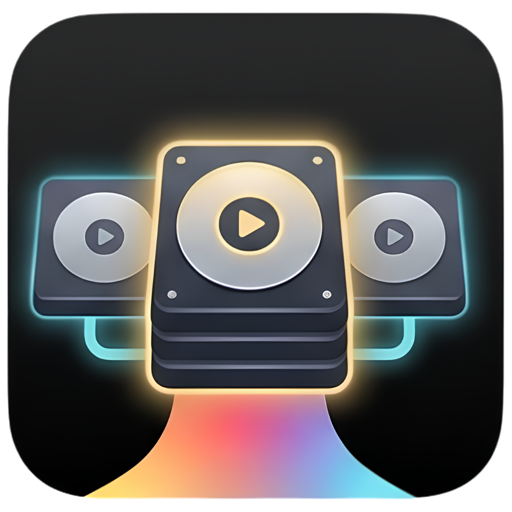

<p align="center">
  
</p>

## Change-Boot

**Pick the macOS you boot into, in one click.**
A startup disk switcher for macOS that verifies the firmware actually took the
change before it restarts the Mac.

[](https://developer.apple.com/xcode/)
[](https://www.apple.com/macos)
[](LICENSE)

Built for a specific need: a second, clean macOS install on an external disk, for
testing apps without anyone else's settings and for recording material.

> Interface language: Polish and English, switchable in the app.

---

## What it does

- **Switches the startup disk and verifies the result.** When `bless` reports
  success but the firmware still points at the old disk, the restart **does not
  happen** — otherwise the Mac would come back up from the wrong system.
- **Clean start.** Apps and windows from before the restart do not return. This
  takes two things at once and both are required: the `TALLogoutSavesState`
  setting, and restarting with the state saving preference.
- **Ejects the whole device, not just the volume.** Finder leaves the hidden data
  volume mounted, and after you pull the cable macOS reports a bad unmount.
- **Remembers systems by volume UUID, not by name.** Renaming a disk breaks
  nothing, and a disconnected disk stays on the list as unavailable.
- **Command line** — the same operations from a script or a scheduler, with fixed
  exit codes and JSON output. Plain `change-boot` opens a full-screen view driven
  by the arrow keys; every verb works as plain text with its exit codes untouched.
- **Event log** — what happened, when, by whom, and with what result.

## Requirements

| | |
|---|---|
| System | macOS 26 or newer |
| Build | Xcode 27 (`LastUpgradeCheck = 2700` in the project) |
| Processor | **Apple Silicon — verified.** The binary is universal and the code compiles for Intel, but `bless`, T2 and Startup Security have **not been verified** on real Intel hardware |
| Privileges | administrator — once when installing the helper, or on every switch if you do not install it. From the window the system password prompt asks; from the terminal, `sudo` in the same shell |
| Signature | **local certificate.** On someone else's Mac, Gatekeeper will ask to allow it the first time |

> [!warning]
> On Apple Silicon the first blessing of a volume can require administrator
> credentials — `man bless` says so outright. Later ones may go through on their
> own. Do not count on fully unattended switching the first time.

## What it installs outside itself

This is the most important section of this file. Change-Boot installs **three
things outside its own bundle**, and the Trash removes none of them:

| What | Where | Owner | Created when |
|---|---|---|---|
| Helper (daemon) | launchd, system domain | **root** | "Install helper" in Options |
| `change-boot` | `/usr/local/bin` (symlink) | `root:wheel` | "Install command" in Options |
| Login item | Settings → Login Items | the user | autostart, or "open after coming back" |

The app touches **nothing else**. In particular it does not change system settings
other than `TALLogoutSavesState`, does not read the private `loginwindow` stores,
and sends nothing over the network — no connections, no telemetry, no crash
reporting.

Settings and the event log live in:

```
~/Library/Preferences/com.mikagosz.ChangeBoot.plist
~/Library/Application Support/Change-Boot/
```

## Uninstalling

🔴 **Do this before you drag the icon to the Trash.** Deleting the app leaves a
registered root daemon pointing at nothing, and a symlink you cannot remove
without a password.

From the window: **Options → Uninstall Change-Boot → "Remove everything it
installed"**.

From the terminal — this also works once the window no longer opens:

```bash
change-boot uninstall
```

Both remove the helper, the command and the login item, and **leave settings and
the log untouched** — those are your data, not leftovers. Delete them by hand if
you want to; the paths are printed after the cleanup.

If the app is gone before you cleaned up, the manual route remains:

```bash
sudo rm /usr/local/bin/change-boot
```

The daemon is then removed in System Settings → General → Login Items, under the
Change-Boot entry.

## Command line

```bash
change-boot                       # full-screen view, driven by the arrow keys
change-boot --plain               # the same as plain text
change-boot list                  # configured systems and their availability
change-boot current               # where you are and where the firmware will boot from
change-boot switch "Mac Lab" --restart
change-boot eject "Mac Lab"
change-boot log --limit 50 --json
change-boot uninstall
change-boot help
```

Exit codes are a **contract with scripts** and do not change meaning:

| Code | Means |
|---|---|
| 0 | done |
| 1 | error |
| 2 | bad usage |
| 3 | no such volume |
| 4 | the firmware did not take the target — no restart happened |
| 5 | cancelled by the user |

The command is installed from the app's Options; without it, the full path to the
binary inside the bundle works.

## Building and packaging

```bash
./spakuj.sh
```

🔴 **Do not package with a plain `xcodebuild … build`.** The product depends on the
**action**, not the configuration — both commands say "Release" and produce
different things:

| | `build` | `archive` |
|---|---|---|
| architecture | `arm64` only | `x86_64 arm64` |
| entitlements | with `get-task-allow` | clean |

`get-task-allow` lets a debugger attach to the running app. In an app that talks to
a root daemon, that is a path to root for any process on the user's account.
`spakuj.sh` uses `archive` and checks five things afterwards: architecture, absence
of `get-task-allow`, presence of the Apple Events entitlement, Hardened Runtime,
and signature consistency. The package does not come out if any check fails.

## Tests

Headless, through `swiftc`, with no test framework and no mocks — they read the
real disks of this machine, because what is being checked is exactly whether the
reading matches reality. The build command for each one sits in the header of its
`main.swift`.

```
Testy/wykrywanie     disks, volumes, telling Cryptexes apart from systems
Testy/konfiguracja   the list, colours, persistence of a disconnected disk entry
Testy/pomocnik       shape of the restart, mount point sieve, signature match
Testy/dziennik       writing and reading, concurrency, argument parsing
Testy/terminal       colour conversion, panel widths, frame placement
```

Without an external disk connected, some checks are **explicitly skipped**, not
quietly passed.

## Licence

The **source code** is MIT — see [LICENSE](LICENSE).

The **app icon is not**. `Change-Boot/change-boot icon.icon/` is Copyright (c) 2026
mikagosz, all rights reserved, and is excluded from the MIT grant — see
[NOTICE](NOTICE). It ships with the repository so the project builds as it is
shipped; if you fork this project, replace it with your own icon.
